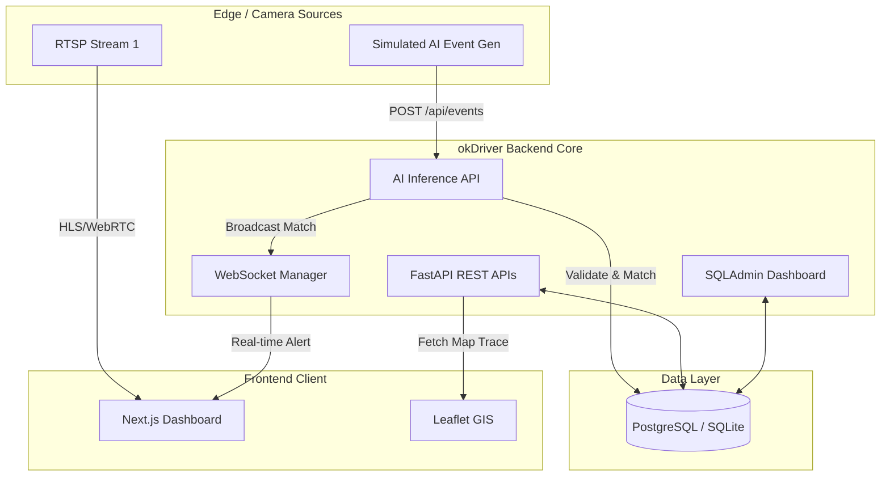
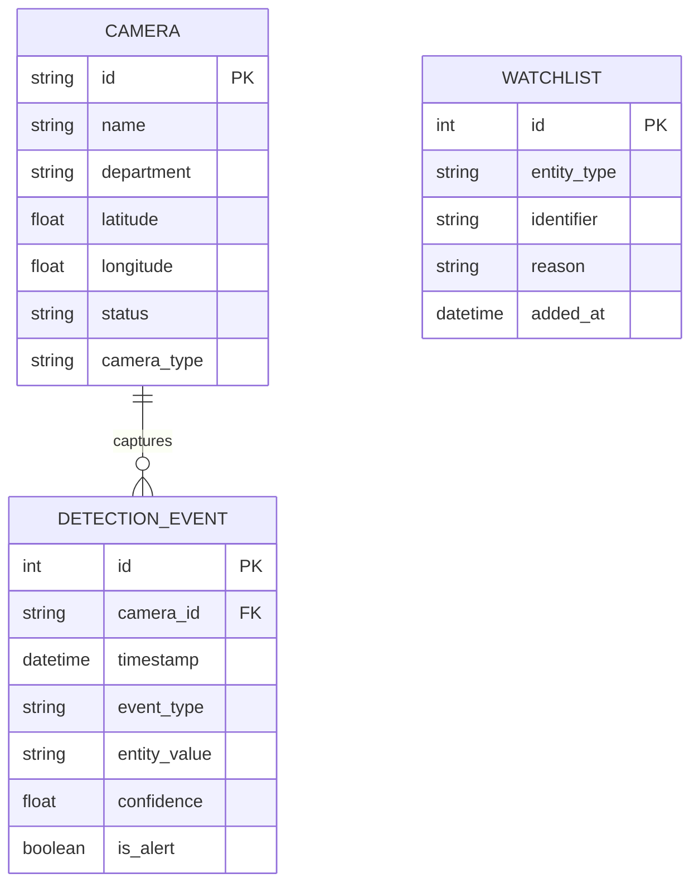

# okDriver Smart Dashcams - Full Stack Hackathon Submission

**Candidate:** Yash Chauhan  
**Role:** Full Stack Developer  

This repository contains the completed prototype for the **okDriver Integrated CCTV Monitoring and Real-Time Alert Platform**, aligned with the Gujarat Police Innovation Hackathon 2026 problem statement.

---

## 🚀 Key Features Implemented

1. **Camera Registry & Onboarding:**
   - Full CRUD support via frontend (`/cameras` page) and API (`POST /api/cameras`).
   - Supports manual addition and health monitoring (Online/Offline/Degraded).
2. **Unified Monitoring Dashboard:**
   - CSS-animated simulated camera feeds representing AI edge-processing (object detection, vehicle tracking).
   - Real-time active alert metrics and system statistics.
3. **GIS & Movement Visualization:**
   - Interactive Leaflet map plotting camera locations.
   - Plots chronological vehicle trace history (e.g., tracking `GJ01XX0001` across 5 checkpoints: Traffic Junction -> City Center -> Navrangpura -> Ashram Road -> RTO Checkpoint).
4. **AI Video Analytics & Real-Time Alerts:**
   - Backend `POST /api/events` endpoint to ingest analytics data.
   - Real-time watchlist correlation. Matches generate instant UI alerts via **WebSockets** without page refresh.
5. **Watchlist Management:**
   - Add/manage records via Django-style Admin Panel (`/admin`).

---

## 🛠️ Tech Stack
- **Backend:** FastAPI (Python), Uvicorn
- **Database:** SQLite (Used for prototype, strictly ORM-based via SQLAlchemy for easy migration to PostgreSQL/MySQL RDS)
- **Real-Time:** WebSockets (FastAPI built-in)
- **Frontend:** Next.js, React, TailwindCSS
- **Maps:** React Leaflet (OpenStreetMap)

---

## ⚙️ Setup Instructions

### 1. Backend Setup
```bash
cd backend
python -m venv venv
venv\Scripts\activate  # On Windows
pip install fastapi uvicorn sqlalchemy sqladmin pydantic websockets
python seed_db.py      # Seed the DB with 5 test cameras and vehicle trace
uvicorn main:app --reload
```
*Backend runs on `http://localhost:8000`. API Docs available at `http://localhost:8000/docs`.*

### 2. Frontend Setup
```bash
cd frontend
npm install
npm run dev
```
*Frontend runs on `http://localhost:3000`.*

---

## 🏗️ Architecture Diagram



---

## 🗄️ Database Schema (ER Diagram)



---

## 📈 Scalability & Production Note (80,000 Cameras)

To evolve this prototype into a large distributed platform supporting 80,000 cameras:

1. **Edge Processing:** Deploy AI models locally on edge devices/NVRs to run object detection. Only transmit metadata (JSON) to the central server to save massive video bandwidth.
2. **Message Queues:** Replace the simple HTTP POST for events with **Apache Kafka** or **RabbitMQ** to handle high-throughput telemetry ingestion without dropping packets.
3. **Database Scaling:** Migrate from SQLite to **PostgreSQL on AWS RDS** with TimescaleDB extension for hyper-fast time-series queries on the `detection_events` table. Use partitioned tables by month.
4. **Caching:** Implement **Redis** to cache the active Watchlist in memory so AI events can be correlated with ~0ms latency instead of querying the SQL database per event.
5. **Real-time Push:** Use Redis Pub/Sub combined with horizontal WebSocket clusters (e.g., Socket.io adapters) to handle thousands of active operator dashboards.
